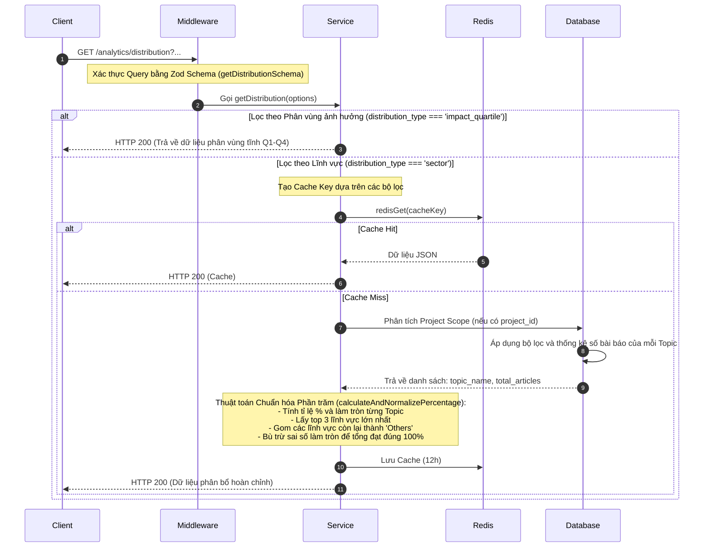

# Tài liệu Chi tiết API: `/analytics/distribution`

API này cung cấp dữ liệu phân bổ (distribution) của các bài báo khoa học theo hai tiêu chí: Lĩnh vực nghiên cứu (Sectors) hoặc Phân vùng ảnh hưởng của tạp chí (Impact Quartiles).

---

## 1. Thông tin chung (Endpoint Overview)

* **URL:** `https://api.trending.researchpulse.io.vn/analytics/distribution`
* **HTTP Method:** `GET`
* **Cơ sở dữ liệu:** PostgreSQL
* **Cơ chế lưu trữ:** Hỗ trợ Redis Cache với TTL **12 giờ**.
* **Cache Key:** `analytics:distribution:v6:{project_id}:{subject_area}:{keywords}:{from_year}:{to_year}` (Chỉ áp dụng khi `distribution_type` là `sector`).

---

## 2. Tham số truy vấn (Query Parameters)

| Tham số | Kiểu dữ liệu | Bắt buộc | Mặc định | Mô tả |
| :--- | :--- | :---: | :---: | :--- |
| **`project_id`** | String | Không | - | ID của dự án để lọc phân bổ theo phạm vi dự án. |
| **`distribution_type`** | String (Enum) | Không | `'sector'` | Loại phân bổ cần lấy. Chấp nhận `'sector'` hoặc `'impact_quartile'`. |
| **`subject_area`** | String | Không | - | Bộ lọc lĩnh vực tùy chọn. |
| **`keywords`** | String | Không | - | Bộ lọc từ khóa tùy chọn (ngăn cách bởi dấu phẩy). |
| **`from_year`** | Integer | Không | - | Bộ lọc năm bắt đầu. |
| **`to_year`** | Integer | Không | - | Bộ lọc năm kết thúc. |

---

## 3. Luồng xử lý chi tiết (Detailed Workflow)



---

## 4. Thuật toán chuẩn hóa tỷ lệ (`calculateAndNormalizePercentage`)

Nhằm đảm bảo tổng tỷ lệ phần trăm hiển thị trên biểu đồ tròn (Pie/Donut chart) luôn đạt **chính xác 100%** mà không bị sai số do làm tròn số thập phân:

1. **Tính tỷ lệ thô:** `percentage = Math.round((count / total) * 100)`.
2. **Sắp xếp & Chọn lọc:** Sắp xếp các danh mục giảm dần theo phần trăm và lấy **Top 3** danh mục lớn nhất.
3. **Gom nhóm nhóm phụ:** Tất cả các nhóm nằm ngoài Top 3 được cộng dồn phần trăm lại thành một danh mục chung tên là **`Others`**.
4. **Bù trừ sai số:**
   * Tính tổng phần trăm tạm thời: $\text{totalSum} = \text{Top 3 Sum} + \text{Others Percentage}$.
   * Tính sai số: $\text{diff} = 100 - \text{totalSum}$.
   * Nếu có danh mục `Others`, cộng giá trị $\text{diff}$ vào `Others`.
   * Nếu không có `Others` (tổng số danh mục nhỏ hơn hoặc bằng 3), cộng $\text{diff}$ trực tiếp vào danh mục Top 1.

---

## 5. Cấu trúc Phản hồi (Response Structure)

### 5.1 Phản hồi thành công cho Sector (HTTP 200 OK)

```json
{
  "code": 200,
  "message": "Fetch distribution successfully",
  "data": [
    {
      "name": "Biotech",
      "percentage": 50
    },
    {
      "name": "Machine Learning",
      "percentage": 30
    },
    {
      "name": "Quantum Computing",
      "percentage": 12
    },
    {
      "name": "Others",
      "percentage": 8
    }
  ]
}
```

### 5.2 Phản hồi thành công cho Impact Quartile (HTTP 200 OK)

```json
{
  "code": 200,
  "message": "Fetch distribution successfully",
  "data": [
    {
      "name": "Q1",
      "percentage": 45
    },
    {
      "name": "Q2",
      "percentage": 30
    },
    {
      "name": "Q3",
      "percentage": 15
    },
    {
      "name": "Q4",
      "percentage": 10
    }
  ]
}
```
