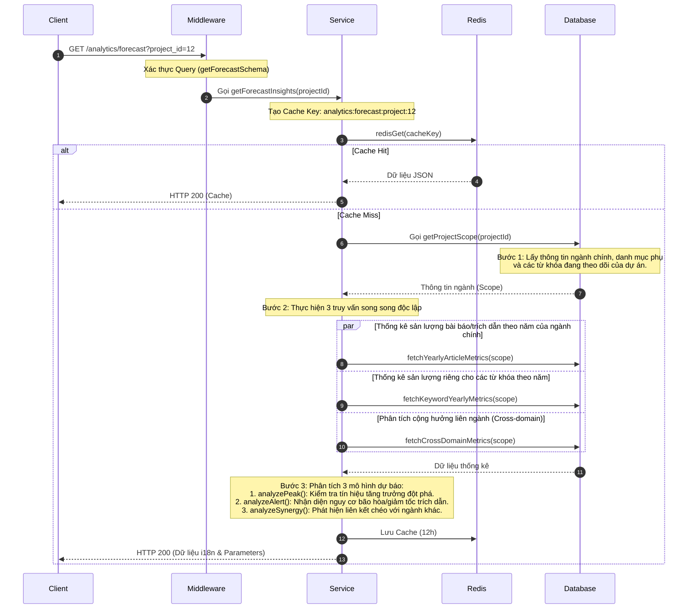

# Tài liệu Chi tiết API: `/analytics/forecast`

API này chịu trách nhiệm phân tích hiệu suất lịch sử và từ khóa để đưa ra ba tín hiệu dự báo (Forecast Insights) về tương lai cho một dự án cụ thể: **PEAK** (Đỉnh phát triển), **ALERT** (Cảnh báo bão hòa), và **SYNERGY** (Cộng hưởng liên ngành).

---

## 1. Thông tin chung (Endpoint Overview)

* **URL:** `https://api.trending.researchpulse.io.vn/analytics/forecast`
* **HTTP Method:** `GET`
* **Cơ sở dữ liệu:** PostgreSQL
* **Cơ chế lưu trữ:** Redis Cache với TTL **12 giờ** (43,200 giây).
* **Cache Key:** `analytics:forecast:project:{project_id}`

---

## 2. Tham số truy vấn (Query Parameters)

| Tham số | Kiểu dữ liệu | Bắt buộc | Mô tả |
| :--- | :--- | :---: | :--- |
| **`project_id`** | String | **Có** | ID của dự án để phân tích dự báo. |

---

## 3. Luồng xử lý chi tiết (Detailed Workflow)



---

## 4. Các mô hình thuật toán phân tích (Forecast Models)

API không trả về chuỗi văn bản cứng, mà trả về mã dịch ngôn ngữ (**i18n keys**) và mảng tham số (**parameters**) để phía Frontend tự động biên dịch và hiển thị linh hoạt theo đa ngôn ngữ.

### 4.1. Dự báo Đỉnh phát triển (`PEAK`)
* **Mục tiêu:** Nhận diện lĩnh vực nghiên cứu của dự án có đang bước vào giai đoạn bùng nổ hay không.
* **Tín hiệu Đỉnh (`emerging_peak`):** Được kích hoạt khi sản lượng bài báo năm gần nhất > 0 và đạt ít nhất một trong các điều kiện sau:
  * Tốc độ tăng trưởng bài báo năm gần nhất $\ge 25\%$.
  * Tốc độ tăng trưởng bài báo trung bình 3 năm gần nhất $\ge 20\%$.
  * Tốc độ tăng trưởng trích dẫn năm gần nhất $\ge 30\%$.

### 4.2. Cảnh báo Bão hòa (`ALERT`)
* **Mục tiêu:** Cảnh báo khi một lĩnh vực nghiên cứu đang có dấu hiệu giảm sức hút hoặc bão hòa.
* **Tín hiệu bão hòa (`saturation_risk`):** Được kích hoạt khi sản lượng bài báo năm gần nhất > 0 và đạt ít nhất một trong các điều kiện:
  * Tỷ lệ trích dẫn trung bình trên mỗi bài báo (`citationPerArticle`) giảm $\ge 15\%$ so với năm trước.
  * Tốc độ tăng trưởng bài báo giảm $\ge 20\%$ so với tốc độ tăng trưởng năm trước (`growthSlowdown`).
  * Năm trước tăng trưởng cực mạnh ($\ge 20\%$) nhưng năm nay bị chững lại đột ngột ($\le 5\%$).

### 4.3. Phân tích Cộng hưởng (`SYNERGY`)
* **Mục tiêu:** Tìm kiếm sự kết hợp giữa các từ khóa của dự án với các lĩnh vực nghiên cứu bên ngoài ngành chính của dự án.
* **Thuật toán:** Tìm kiếm bài báo chứa từ khóa của dự án nhưng thuộc về một `Subject_Area` khác. Kết quả trả về từ khóa hoạt động mạnh nhất và lĩnh vực liên quan để gợi ý hướng nghiên cứu liên ngành.

---

## 5. Cấu trúc Phản hồi (Response Structure)

### 5.1 Phản hồi thành công (HTTP 200 OK)

```json
{
  "code": 200,
  "message": "Fetch forecast insights successfully",
  "data": [
    {
      "type": "PEAK",
      "title_key": "forecast.peak.title",
      "insight_key": "forecast.peak.insight",
      "parameters": {
        "subject": "Computer Science",
        "signal": "emerging_peak",
        "latestYear": 2025,
        "articleCount": 145,
        "citationCount": 1250,
        "growthRate": 28.5,
        "averageGrowthRate": 22.1,
        "citationGrowthRate": 35
      }
    },
    {
      "type": "ALERT",
      "title_key": "forecast.alert.title",
      "insight_key": "forecast.alert.no_saturation_signal",
      "parameters": {
        "subject": "Computer Science",
        "signal": "no_saturation_signal",
        "latestYear": 2025,
        "articleCount": 145,
        "citationPerArticle": 8.62,
        "citationPerArticleChange": 5,
        "latestGrowthRate": 28.5,
        "previousGrowthRate": 21,
        "growthSlowdown": 7.5
      }
    },
    {
      "type": "SYNERGY",
      "title_key": "forecast.synergy.title",
      "insight_key": "forecast.synergy.insight",
      "parameters": {
        "subject": "Computer Science",
        "keyword": "Deep Learning",
        "relatedSubject": "Medical Informatics",
        "signal": "cross_domain_synergy",
        "articleCount": 18,
        "citationCount": 240
      }
    }
  ]
}
```
