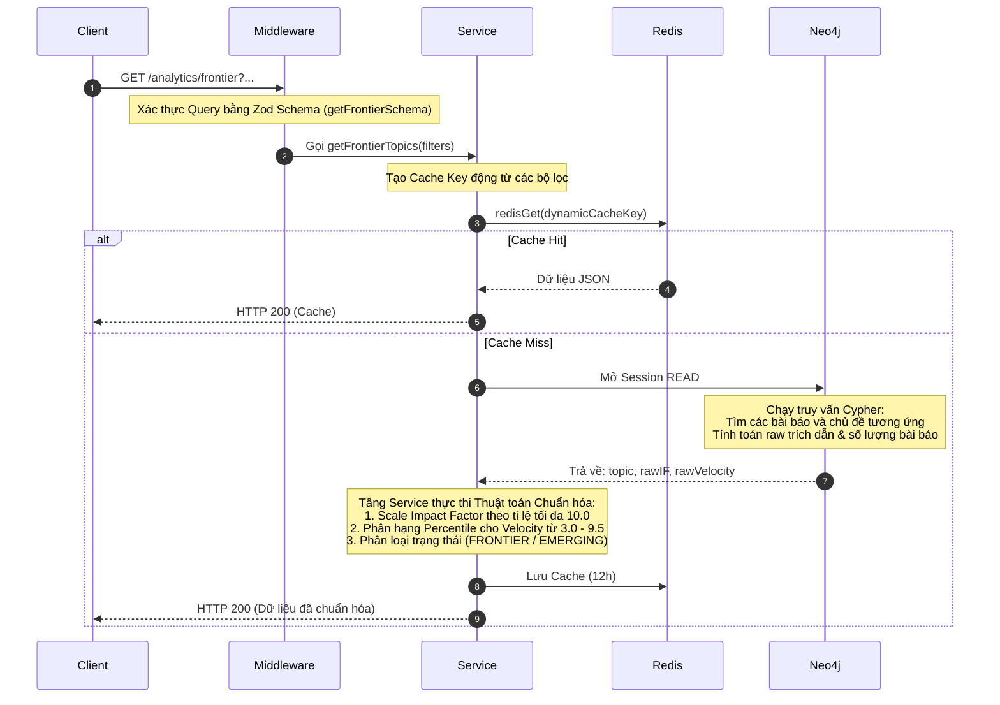

# Tài liệu Chi tiết API: `/analytics/frontier`

API này chịu trách nhiệm trả về danh sách các chủ đề công nghệ tiên phong (Frontier) và mới nổi (Emerging) dựa trên hai chỉ số: Tầm ảnh hưởng (Impact Factor) và Tốc độ tăng trưởng trích dẫn (Citation Velocity).

---

## 1. Thông tin chung (Endpoint Overview)

* **URL:** `https://api.trending.researchpulse.io.vn/analytics/frontier`
* **HTTP Method:** `GET`
* **Cơ sở dữ liệu:** **Neo4j** (đồ thị tri thức khoa học) thay vì PostgreSQL.
* **Cơ chế lưu trữ:** Redis Cache với TTL **12 giờ**.
* **Cache Key:**
  * Mặc định: `analytics:frontier:topics:v6`
  * Có bộ lọc: `analytics:frontier:topics:v6:filters:subjectArea:xxx|topicNames:yyy|keywords:zzz`

---

## 2. Tham số truy vấn (Query Parameters)

| Tham số | Kiểu dữ liệu | Bắt buộc | Mô tả |
| :--- | :--- | :---: | :--- |
| **`subjectArea`** | String | Không | Lọc các chủ đề thuộc một lĩnh vực nghiên cứu (ví dụ: *Computer Science*). |
| **`keywords`** | String / Array | Không | Danh sách từ khóa lọc kèm (chấp nhận cả keyword, keywordIds, keywordId). |

---

## 3. Luồng xử lý chi tiết (Detailed Workflow)



---

## 4. Chi tiết thuật toán phân tích (Algorithm Details)

Sau khi lấy được số lượng bài báo (`articleCount`) và số trích dẫn (`citationCount`) cho mỗi Topic từ Neo4j, tầng Service thực hiện chuẩn hóa số liệu:

### 4.1. Chuẩn hóa Impact Factor (`impactFactor`)
* `rawIF = citationCount / articleCount`
* Tìm ra giá trị ảnh hưởng lớn nhất (`maxIF`) trong danh sách kết quả.
* Tỷ lệ phóng đại: `scaleIF = 10.0 / maxIF`
* Điểm số chuẩn hóa: `impactFactor = Math.round((rawIF * scaleIF) * 10) / 10`.

### 4.2. Chuẩn hóa Tốc độ trích dẫn (`citationVelocity`)
* Sắp xếp các giá trị trích dẫn thô tăng dần để tìm phân vị (Percentile rank) cho từng chủ đề.
* Tính tỷ lệ phân hạng (`rank` từ `0.0` đến `1.0`): `rank = index / (total_topics - 1)`.
* Chuẩn hóa về thang điểm từ **3.0** đến **9.5**:
  $$\text{citationVelocity} = 3.0 + \text{rank} \times 6.5$$

### 4.3. Phân nhóm trạng thái (`status`)
* **`FRONTIER` (Tiên phong):** Nếu $\text{impactFactor} \ge 3.0$ và $\text{citationVelocity} \ge 5.0$.
* **`EMERGING` (Mới nổi):** Các trường hợp còn lại.

---

## 5. Câu lệnh Cypher truy vấn (Neo4j Query)

```cypher
MATCH (t:Topic)<-[:HAS_TOPIC]-(a:Article)
WHERE coalesce(a.is_deleted, false) = false
  AND ($subjectArea = "" OR toLower(t.name) = toLower($subjectArea))
  AND (size($topicNames) = 0 OR t.name IN $topicNames)
WITH t, collect(a) AS articles
UNWIND articles AS a
OPTIONAL MATCH (citing:Article)-[:REFERENCES]->(a)
WHERE coalesce(citing.is_deleted, false) = false
WITH t, count(DISTINCT a) AS articleCount, count(citing) AS citationCount
WHERE articleCount > 0
RETURN t.name AS topic,
       toFloat(citationCount) / articleCount AS rawIF,
       toFloat(citationCount) AS rawVelocity
ORDER BY rawIF DESC
LIMIT 10
```

---

## 6. Cấu trúc Phản hồi (Response Structure)

### 6.1 Phản hồi thành công (HTTP 200 OK)

```json
{
  "code": 200,
  "message": "Fetch frontier topics successfully",
  "data": [
    {
      "topic": "Generative AI",
      "impactFactor": 10,
      "citationVelocity": 9.5,
      "status": "FRONTIER"
    },
    {
      "topic": "Quantum Machine Learning",
      "impactFactor": 4.5,
      "citationVelocity": 6.8,
      "status": "FRONTIER"
    },
    {
      "topic": "Neuromorphic Computing",
      "impactFactor": 2.1,
      "citationVelocity": 4.2,
      "status": "EMERGING"
    }
  ]
}
```
