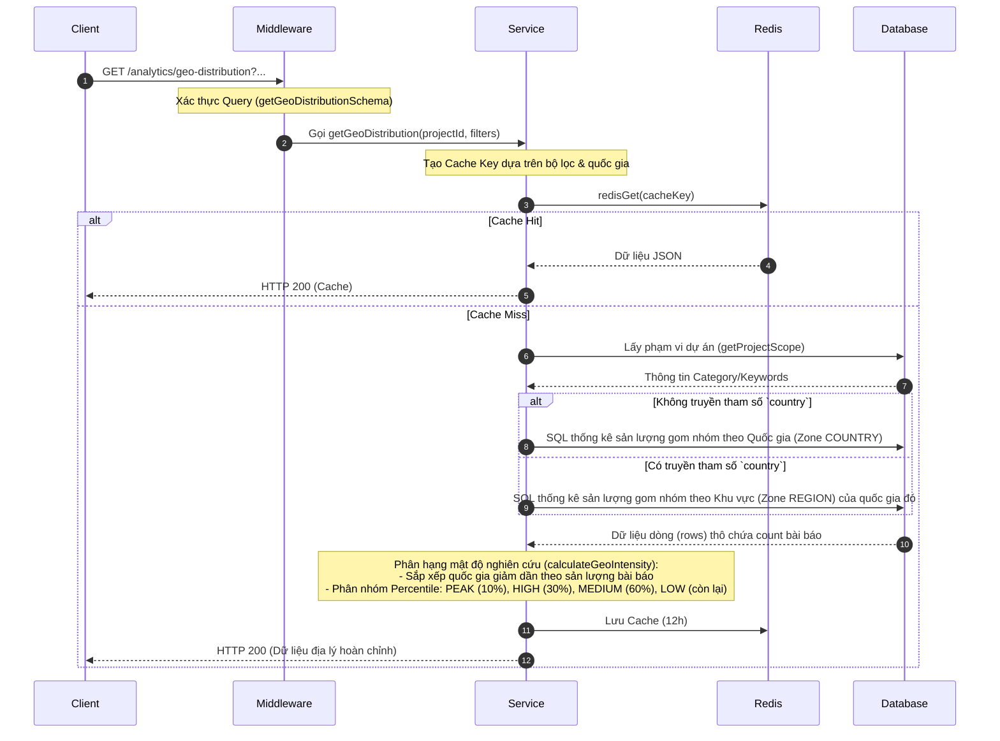

# Tài liệu Chi tiết API: `/analytics/geo-distribution`

API này chịu trách nhiệm trả về mật độ sản lượng công bố bài báo khoa học theo khu vực địa lý (Quốc gia hoặc Vùng lãnh thổ con) phù hợp với phạm vi theo dõi của dự án (`project_id`).

---

## 1. Thông tin chung (Endpoint Overview)

* **URL:** `https://api.trending.researchpulse.io.vn/analytics/geo-distribution`
* **HTTP Method:** `GET`
* **Cơ sở dữ liệu:** PostgreSQL
* **Cơ chế lưu trữ:** Redis Cache với TTL **12 giờ**.
* **Cache Key:**
  * Lọc mặc định: `analytics:geo-distribution:{project_id}:{subject_area}:{keywords}:{from_year}:{to_year}`
  * Lọc theo quốc gia cụ thể: `analytics:geo-distribution:{project_id}:country:{country}:{subject_area}:{keywords}:{from_year}:{to_year}`

---

## 2. Tham số truy vấn (Query Parameters)

| Tham số | Kiểu dữ liệu | Bắt buộc | Mô tả |
| :--- | :--- | :---: | :--- |
| **`project_id`** | String | **Có** | ID của dự án để xác định phạm vi phân tích. |
| **`country`** | String | Không | Lọc theo tên, mã ISO Alpha-2/Alpha-3, hoặc ID vùng. Nếu truyền, API sẽ trả về dữ liệu phân bổ theo **Vùng (Region)** bên trong quốc gia đó. |
| **`subject_area`** | String | Không | Bộ lọc lĩnh vực tùy chọn. |
| **`keywords`** | String | Không | Bộ lọc danh sách từ khóa tùy chọn (ngăn cách bởi dấu phẩy). |
| **`from_year`** | Integer | Không | Bộ lọc năm bắt đầu. |
| **`to_year`** | Integer | Không | Bộ lọc năm kết thúc. |

---

## 3. Luồng xử lý chi tiết (Detailed Workflow)



---

## 4. Thuật toán phân hạng cường độ nghiên cứu (`calculateGeoIntensity`)

Nhằm phân loại trực quan mật độ công bố trên bản đồ thế việc/khu vực:
1. Sắp xếp danh sách quốc gia giảm dần theo số lượng bài báo (`count`).
2. Với mỗi phần tử ở vị trí thứ $i$ trong danh sách có độ dài $L$, tính toán phân vị: $\text{percentile} = i / L$.
3. Phân hạng cường độ (`intensity`):
   * **`PEAK` (Đỉnh):** Nếu $\text{percentile} < 0.1$ hoặc là quốc gia đứng đầu ($i = 0$).
   * **`HIGH` (Cao):** Nếu $0.1 \le \text{percentile} < 0.3$.
   * **`MEDIUM` (Trung bình):** Nếu $0.3 \le \text{percentile} < 0.6$.
   * **`LOW` (Thấp):** Các trường hợp còn lại.

---

## 5. Các bảng Cơ sở Dữ liệu tham gia

* **`Article`**: Chứa thông tin bài báo, năm xuất bản.
* **`Issue` $\rightarrow$ `Volume` $\rightarrow$ `Journal`**: Liên kết bài báo đến Tạp chí xuất bản.
* **`Zone`**: Lưu trữ các vùng địa lý, phân loại theo `COUNTRY` hoặc `REGION` (chứa mã code Alpha-2, display_name).

---

## 6. Cấu trúc Phản hồi (Response Structure)

### 6.1 Phản hồi phân bổ theo Quốc gia toàn cầu (Không truyền `country` - HTTP 200 OK)

```json
{
  "code": 200,
  "message": "Fetch geographical metrics successfully",
  "data": [
    {
      "countryCode": "US",
      "count": 85400,
      "intensity": "PEAK"
    },
    {
      "countryCode": "GB",
      "count": 21300,
      "intensity": "HIGH"
    },
    {
      "countryCode": "VN",
      "count": 4200,
      "intensity": "MEDIUM"
    }
  ]
}
```

### 6.2 Phản hồi phân bổ khu vực trong một Quốc gia (Có truyền `country=US` - HTTP 200 OK)

```json
{
  "code": 200,
  "message": "Fetch geographical metrics successfully",
  "data": [
    {
      "countryCode": "US",
      "countryName": "United States",
      "regionCode": "CA",
      "regionName": "California",
      "count": 24500,
      "intensity": "PEAK"
    },
    {
      "countryCode": "US",
      "countryName": "United States",
      "regionCode": "NY",
      "regionName": "New York",
      "count": 18200,
      "intensity": "HIGH"
    }
  ]
}
```
