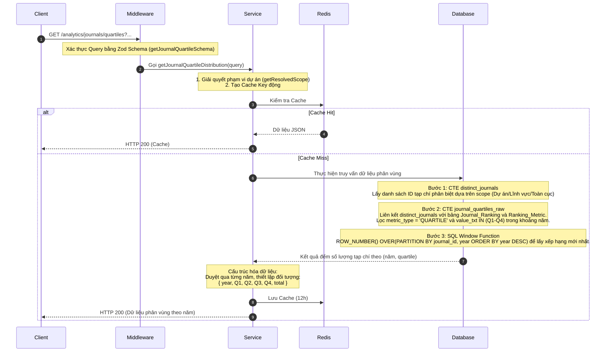

# Tài liệu Chi tiết API: `/analytics/journals/quartiles`

API này chịu trách nhiệm thống kê và trả về tỷ lệ phân bổ của các tạp chí khoa học theo từng phân vùng chất lượng (Quartile Q1 - Q4) trên cơ sở hàng năm, phục vụ trực quan hóa xu hướng chất lượng tạp chí của dự án.

---

## 1. Thông tin chung (Endpoint Overview)

* **URL:** `https://api.trending.researchpulse.io.vn/analytics/journals/quartiles`
* **HTTP Method:** `GET`
* **Cơ sở dữ liệu:** PostgreSQL
* **Cơ chế lưu trữ:** Redis Cache với TTL **12 giờ**.
* **Cache Key:** `analytics:journal-quartiles:v2:{resolvedProjectId}:{mappedDomain}:{categories}:{from_year}:{to_year}`

---

## 2. Tham số truy vấn (Query Parameters)

| Tham số | Kiểu dữ liệu | Bắt buộc | Mặc định | Mô tả |
| :--- | :--- | :---: | :---: | :--- |
| **`project_id`** | String | Không | - | ID của dự án để lọc tạp chí trong phạm vi dự án. |
| **`subject_area`** | String | Không | - | Bộ lọc lĩnh vực nghiên cứu chính. |
| **`keywords`** | String | Không | - | Bộ lọc từ khóa tùy chọn. |
| **`from_year`** | Integer | Không | `2024` | Năm bắt đầu phân tích. |
| **`to_year`** | Integer | Không | `2026` | Năm kết thúc phân tích. |

---

## 3. Luồng xử lý chi tiết (Detailed Workflow)



---

## 4. Cú pháp SQL truy vấn trọng tâm (Core SQL Structure)

Tùy vào tham số truyền vào, hệ thống sinh ra câu lệnh CTE `distinct_journals` khác nhau, sau đó chạy câu lệnh tổng hợp dưới đây:

```sql
WITH distinct_journals AS (
  -- Trích xuất danh sách ID tạp chí phân biệt từ bài báo nằm trong scope --
  SELECT DISTINCT v.journal_id
  FROM "Article" a
  JOIN "Issue" i ON a.issue_id = i.issue_id
  JOIN "Volume" v ON i.volume_id = v.volume_id
  WHERE a.primary_topic IN (SELECT topic_id FROM target_topics)
),
journal_quartiles_raw AS (
  SELECT 
    jr.journal_id,
    jr.value_txt AS quartile,
    jr.year,
    ROW_NUMBER() OVER(PARTITION BY jr.journal_id, jr.year ORDER BY jr.year DESC) as rn
  FROM "Journal_Ranking" jr
  JOIN "Ranking_Metric" rm ON rm.metric_id = jr.metric_id
  WHERE jr.journal_id IN (SELECT journal_id FROM distinct_journals)
    AND rm.metric_type = 'QUARTILE'
    AND jr.value_txt IN ('Q1', 'Q2', 'Q3', 'Q4')
    AND jr.year >= $1
    AND jr.year <= $2
),
yearly_distribution AS (
  SELECT year, quartile, COUNT(DISTINCT journal_id) as count
  FROM journal_quartiles_raw
  WHERE rn = 1
  GROUP BY year, quartile
)
SELECT year, quartile, count
FROM yearly_distribution
ORDER BY year ASC, quartile ASC;
```

---

## 5. Cấu trúc Phản hồi (Response Structure)

### 5.1 Phản hồi thành công (HTTP 200 OK)

```json
{
  "code": 200,
  "message": "Fetch quartile distribution successfully",
  "data": {
    "distributions": [
      {
        "year": "2024",
        "Q1": 24,
        "Q2": 15,
        "Q3": 8,
        "Q4": 3,
        "total": 50
      },
      {
        "year": "2025",
        "Q1": 30,
        "Q2": 18,
        "Q3": 5,
        "Q4": 2,
        "total": 55
      },
      {
        "year": "2026",
        "Q1": 12,
        "Q2": 6,
        "Q3": 2,
        "Q4": 0,
        "total": 20
      }
    ]
  }
}
```
