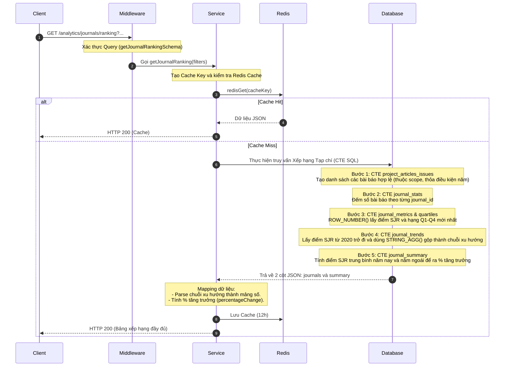

# Tài liệu Chi tiết API: `/analytics/journals/ranking`

API này cung cấp danh sách xếp hạng các tạp chí khoa học chuyên ngành dựa trên chỉ số sức ảnh hưởng SJR (Scimago Journal Rank), đồng thời thống kê số lượng bài báo trong phạm vi dự án, tạo dữ liệu xu hướng nhiều năm và hiển thị các chỉ số trung bình tổng quan.

---

## 1. Thông tin chung (Endpoint Overview)

* **URL:** `https://api.trending.researchpulse.io.vn/analytics/journals/ranking`
* **HTTP Method:** `GET`
* **Cơ sở dữ liệu:** PostgreSQL
* **Cơ chế lưu trữ:** Redis Cache với TTL **12 giờ**.
* **Cache Key:** `analytics:journal-ranking:v2:{resolvedProjectId}:{mappedDomain}:{categories}:{fromYear}:{toYear}:{page}:{limit}`

---

## 2. Tham số truy vấn (Query Parameters)

| Tham số | Kiểu dữ liệu | Bắt buộc | Mặc định | Mô tả |
| :--- | :--- | :---: | :---: | :--- |
| **`project_id`** | String | **Có** | - | ID của dự án để lọc tạp chí trong phạm vi nghiên cứu. |
| **`subject_area`** | String | Không | - | Bộ lọc lĩnh vực nghiên cứu (Domain). |
| **`keywords`** | String | Không | - | Mảng từ khóa hoặc danh mục chuyên ngành. |
| **`from_year`** | Integer | Không | - | Bộ lọc năm xuất bản của bài báo (bắt đầu). |
| **`to_year`** | Integer | Không | - | Bộ lọc năm xuất bản của bài báo (kết thúc). |
| **`page`** | Integer | Không | `1` | Số trang (cho phân trang). |
| **`limit`** | Integer | Không | `10` | Số lượng tạp chí trả về tối đa mỗi trang. |

---

## 3. Luồng xử lý chi tiết (Detailed Workflow)



---

## 4. Đặc tả truy vấn cốt lõi (Core SQL Logic)

Câu lệnh SQL sử dụng một loạt CTE (Common Table Expressions) để xử lý toàn bộ phân trang, xếp hạng và xu hướng trong 1 lần truy vấn:

1. **`journal_stats`**: Tính toán tổng bài báo (`article_count`) của dự án xuất bản trên mỗi tạp chí.
2. **`journal_metrics_raw` & `journal_quartiles_raw`**: Sử dụng `ROW_NUMBER() OVER(PARTITION BY journal_id ORDER BY year DESC)` để trích xuất chỉ số SJR (`value_float`) và Quartile (`value_txt`) gần nhất (rn = 1).
3. **`journal_trends`**: Lấy lịch sử xếp hạng SJR từ năm 2020, sử dụng `STRING_AGG(value_float::text, ',' ORDER BY year ASC)` để tạo mảng dữ liệu phục vụ vẽ biểu đồ mini (sparkline trend).
4. **`journal_page`**: Thực hiện phép `JOIN` với bảng `"Journal"` và `"Publisher"`. Sắp xếp tạp chí theo `impactFactor DESC, article_count DESC`, thực hiện `LIMIT` và `OFFSET`. Cột `COUNT(*) OVER() AS total_count` lấy tổng số tạp chí để phân trang.
5. **`journal_summary`**: Sử dụng truy vấn con để lấy trung bình cộng (`AVG`) điểm SJR mới nhất so với điểm SJR của kỳ báo cáo trước (`year <= to_year - 1`) để tính độ lệch (`percentageChange`).

---

## 5. Cấu trúc Phản hồi (Response Structure)

### 5.1 Phản hồi thành công (HTTP 200 OK)

```json
{
  "code": 200,
  "message": "Fetch journal rankings successfully",
  "data": {
    "journals": [
      {
        "id": "14",
        "name": "Nature Reviews Drug Discovery",
        "publisher": "Nature Research",
        "issn": "1474-1784",
        "impactFactor": 32.57,
        "sjrRank": "Q1",
        "trend": [15.2, 19.4, 22.3, 30.5, 32.57]
      },
      {
        "id": "112",
        "name": "Journal of Medical Informatics",
        "publisher": "Elsevier",
        "issn": "2123-5678",
        "impactFactor": 8.45,
        "sjrRank": "Q1",
        "trend": [6.1, 7.3, 7.8, 8.1, 8.45]
      }
    ],
    "pagination": {
      "totalCount": 128,
      "page": 1,
      "limit": 10,
      "totalPages": 13
    },
    "summary": {
      "averageImpactFactor": 11.91,
      "percentageChange": "+4.2%",
      "trackedCount": 128,
      "limit": 150
    }
  }
}
```

> **Ghi chú dữ liệu:**
> - `averageImpactFactor`: Điểm SJR trung bình của tất cả tạp chí trong danh sách (không phân trang).
> - `percentageChange`: So sánh với kỳ trước (năm ngoái hoặc trước `to_year`).
> - `trend`: Cung cấp lịch sử chỉ số SJR từ năm 2020 để Front-end vẽ dạng đường xu hướng (Sparkline).
