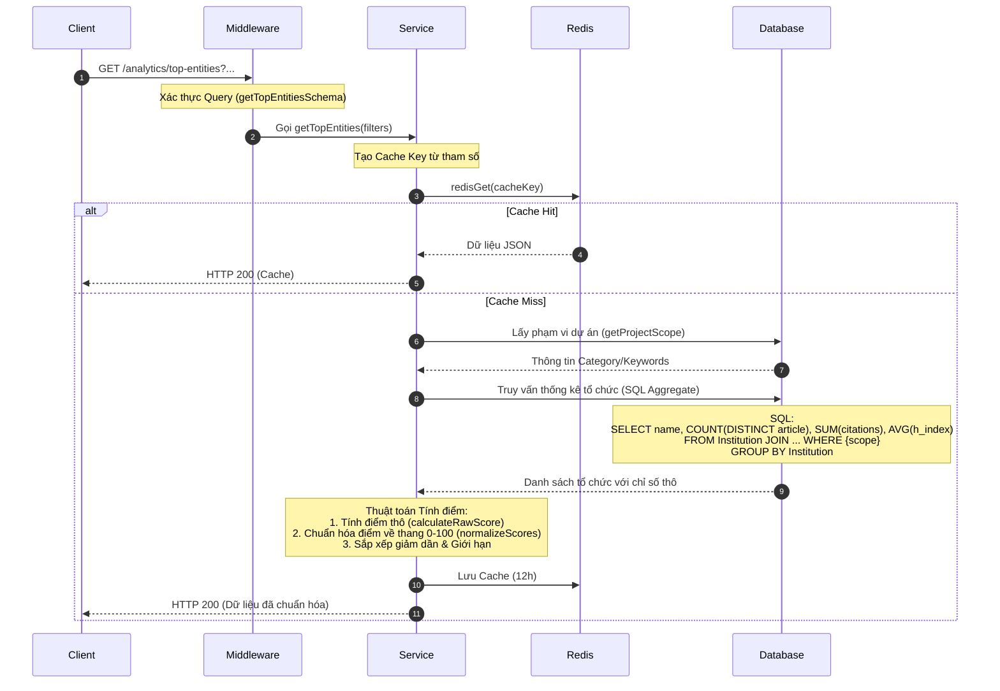

# Tài liệu Chi tiết API: `/analytics/top-entities`

API này cung cấp danh sách các tổ chức, đại học hoặc trung tâm nghiên cứu hàng đầu dựa trên sức ảnh hưởng trong phạm vi dự án (`project_id`). Điểm số được tính toán từ sự kết hợp của số lượng bài báo, trích dẫn và H-index của các tác giả thuộc tổ chức đó.

---

## 1. Thông tin chung (Endpoint Overview)

* **URL:** `https://api.trending.researchpulse.io.vn/analytics/top-entities`
* **HTTP Method:** `GET`
* **Cơ sở dữ liệu:** PostgreSQL
* **Cơ chế lưu trữ:** Redis Cache với TTL **12 giờ**.
* **Cache Key:** `analytics:top-entities:project:{projectId}:limit:{limit}:type:{type}:from:{fromYear}:to:{toYear}`

---

## 2. Tham số truy vấn (Query Parameters)

| Tham số | Kiểu dữ liệu | Bắt buộc | Mặc định | Mô tả |
| :--- | :--- | :---: | :---: | :--- |
| **`project_id`** | String | **Có** | - | ID của dự án để xác định phạm vi phân tích. |
| **`entity_type`** | String | Không | `institution` | Loại thực thể: `institution`, `university`, hoặc `research_center`. |
| **`limit`** | Integer | Không | `10` | Số lượng tổ chức trả về (tối đa `50`). |
| **`from_year`** | Integer | Không | - | Năm bắt đầu lọc. |
| **`to_year`** | Integer | Không | - | Năm kết thúc lọc. |

---

## 3. Luồng xử lý chi tiết (Detailed Workflow)



---

## 4. Thuật toán tính điểm (`calculateRawScore` & `normalizeScores`)

Hệ thống sử dụng công thức trọng số để đánh giá tầm ảnh hưởng của các tổ chức:

### 4.1. Điểm thô (`calculateRawScore`)
Công thức tính dựa trên sự kết hợp của 3 chỉ số chính:
$$\text{RawScore} = (\text{article\_count} \times 0.4) + (\text{citation\_count} \times 0.5) + (\text{h\_index} \times 0.1)$$
* **Số lượng bài báo (40%):** Đánh giá năng suất công bố.
* **Số lượng trích dẫn (50%):** Đánh giá chất lượng và tầm ảnh hưởng.
* **H-index (10%):** Đánh giá uy tín của đội ngũ tác giả.

### 4.2. Chuẩn hóa điểm (`normalizeScores`)
Điểm thô sau đó được chuẩn hóa về thang điểm **0 - 100** bằng phương pháp Min-Max Scaling để đảm bảo tính dễ đọc cho biểu đồ:
$$\text{NormalizedScore} = \frac{\text{RawScore} - \text{MinRaw}}{\text{MaxRaw} - \text{MinRaw}} \times 100$$
*(Nếu `MaxRaw == MinRaw`, tất cả đều nhận điểm 100).*

---

## 5. Cấu trúc Phản hồi (Response Structure)

### 5.1 Phản hồi thành công (HTTP 200 OK)

```json
{
  "code": 200,
  "message": "Fetch top entities successfully",
  "data": [
    {
      "name": "Stanford University",
      "score": 94.2
    },
    {
      "name": "Massachusetts Institute of Technology",
      "score": 88.5
    },
    {
      "name": "University of Cambridge",
      "score": 75.0
    }
  ]
}
```
