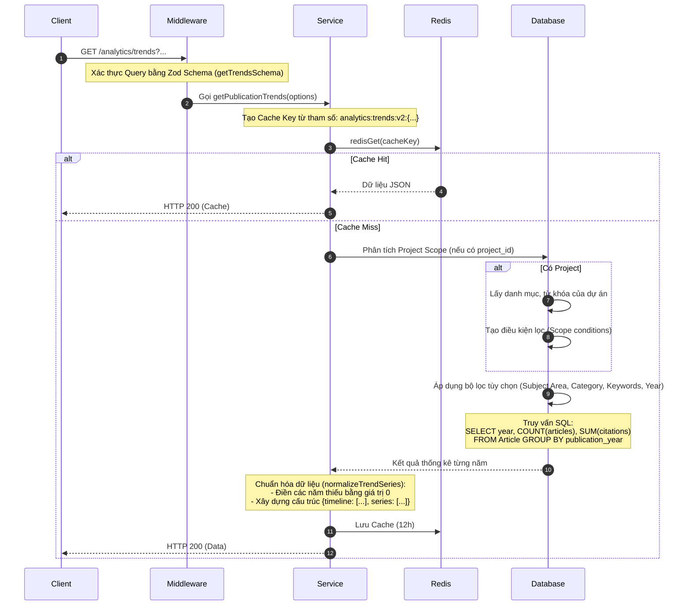

# Tài liệu Chi tiết API: `/analytics/trends`

API này cung cấp dữ liệu xu hướng (trends) về số lượng bài báo và trích dẫn theo thời gian, hỗ trợ trực quan hóa cho biểu đồ đường hoặc biểu đồ cột. Dữ liệu có thể được lọc theo dự án, lĩnh vực hoặc từ khóa cụ thể.

---

## 1. Thông tin chung (Endpoint Overview)

* **URL:** `https://api.trending.researchpulse.io.vn/analytics/trends`
* **HTTP Method:** `GET`
* **Content-Type:** `application/json`
* **Cơ chế lưu trữ:** Hỗ trợ Cache bằng Redis với thời gian sống (TTL) là **12 giờ**. Cache key được tạo dựa trên tất cả các tham số lọc để đảm bảo tính nhất quán.

---

## 2. Tham số truy vấn (Query Parameters)

| Tham số | Kiểu dữ liệu | Bắt buộc | Mô tả |
| :--- | :--- | :---: | :--- |
| **`project_id`** | String | Không | ID của dự án để lọc dữ liệu trong phạm vi của dự án đó. |
| **`subject_area`** | String | Không | Lọc thu hẹp theo lĩnh vực nghiên cứu (ví dụ: *Computer Science*). |
| **`subject_category`** | String | Không | Lọc theo một danh mục ngành cụ thể. |
| **`keywords`** | String | Không | Chuỗi từ khóa phân cách bằng dấu phẩy. |
| **`from_year`** | Integer | Không | Năm bắt đầu lọc. |
| **`to_year`** | Integer | Không | Năm kết thúc lọc. |

---

## 3. Luồng xử lý chi tiết (Detailed Workflow)



---

## 4. Logic cốt lõi: Chuẩn hóa dữ liệu (`normalizeTrendSeries`)

Đây là bước quan trọng để đảm bảo biểu đồ không bị "đứt đoạn". 
1. Nếu một khoảng năm có một năm không có bài báo nào (ví dụ: 2023 có 0 bài), API **tự động chèn giá trị 0** cho cả số bài báo và số trích dẫn cho năm đó.
2. Dữ liệu được trả về dưới dạng:
   - `timeline`: Mảng các năm (string).
   - `series`: Mảng đối tượng gồm `Articles` và `Citations` với dữ liệu tương ứng.

---

## 5. Cấu trúc Phản hồi (Response Structure)

### 5.1 Phản hồi thành công (HTTP 200 OK)

```json
{
  "code": 200,
  "message": "Fetch publication trends successfully",
  "data": {
    "timeline": ["2021", "2022", "2023", "2024", "2025"],
    "series": [
      {
        "name": "Articles",
        "data": [120, 150, 0, 220, 280]
      },
      {
        "name": "Citations",
        "data": [500, 750, 0, 1100, 1400]
      }
    ]
  }
}
```
