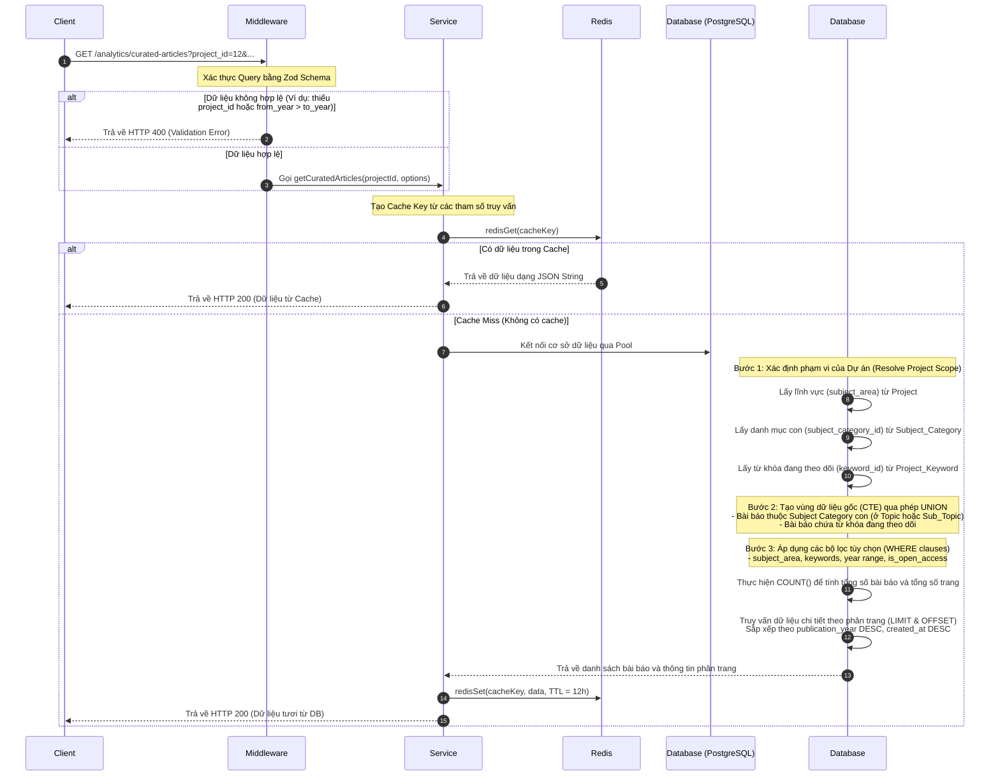
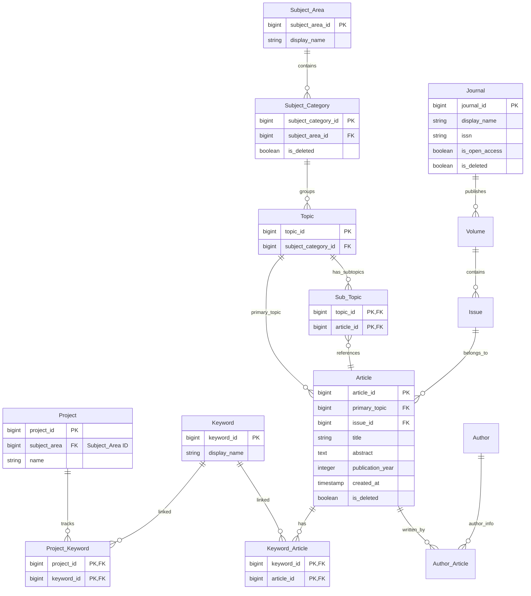

# Tài liệu Chi tiết API: `/analytics/curated-articles`

API này chịu trách nhiệm truy xuất danh sách các bài báo nghiên cứu (articles) đã được giám tuyển (curated) dành riêng cho một dự án cụ thể. Phạm vi các bài báo này được tự động xác định dựa trên lĩnh vực nghiên cứu chính và danh sách từ khóa mà dự án đang theo dõi. Ngoài ra, API hỗ trợ lọc nâng cao theo chủ đề, từ khóa tùy chọn, năm xuất bản, trạng thái Open Access và phân trang đầy đủ.

---

## 1. Thông tin chung (Endpoint Overview)

* **URL ví dụ:** `https://api.trending.researchpulse.io.vn/analytics/curated-articles?project_id=12&page=2&limit=10`
* **HTTP Method:** `GET`
* **Content-Type:** `application/json`
* **Cơ chế lưu trữ:** Hỗ trợ Cache bằng Redis với thời gian sống (TTL) là **12 giờ** (43,200 giây). Cache tự động bị xóa (invalidated) khi dự án thêm hoặc xóa từ khóa đang theo dõi.

---

## 2. Tham số truy vấn (Query Parameters)

Dưới đây là danh sách chi tiết các tham số truyền qua Query String:

| Tham số | Kiểu dữ liệu | Bắt buộc | Mặc định | Mô tả |
| :--- | :--- | :---: | :---: | :--- |
| **`project_id`** | String | **Có** | - | ID của dự án để xác định phạm vi phân tích dữ liệu. |
| **`page`** | Integer | Không | `1` | Số trang muốn lấy (phải là số nguyên dương $\ge 1$). |
| **`limit`** | Integer | Không | `10` | Số lượng bài báo trên mỗi trang (tối đa `100`). |
| **`subject_area`** | String | Không | - | Lọc thu hẹp bài báo theo tên lĩnh vực nghiên cứu (ví dụ: *Computer Science*). |
| **`keywords`** | String | Không | - | Chuỗi các từ khóa phân cách bằng dấu phẩy để lọc thêm bài báo (ví dụ: *AI, Machine Learning*). |
| **`from_year`** | Integer | Không | - | Lọc bài báo xuất bản từ năm này trở đi (phải bé hơn hoặc bằng `to_year`). |
| **`to_year`** | Integer | Không | - | Lọc bài báo xuất bản đến năm này trở về trước. |
| **`is_open_access`** | Boolean | Không | - | Nhận diện giá trị `'true'` hoặc `true`. Nếu truyền, chỉ trả về các bài báo thuộc tạp chí mở (Open Access). |

---

## 3. Luồng xử lý chi tiết (Detailed Workflow)

API hoạt động thông qua một quy trình kiểm tra và xử lý dữ liệu nghiêm ngặt từ middleware xác thực đến tầng cơ sở dữ liệu:



### Các bước thực thi chính trong mã nguồn:

1. **Xác thực dữ liệu (Request Validation):**
   Middleware `validateQuery(getCuratedArticlesSchema)` sẽ đảm bảo:
   * Tham số `project_id` không được để trống.
   * `page` và `limit` được ép kiểu về dạng số và kiểm tra giới hạn.
   * Nếu có cả `from_year` và `to_year`, đảm bảo `from_year` $\le$ `to_year`.

2. **Xác định Phạm vi Dự án (Project Scope Resolution):**
   * Hệ thống tìm kiếm dự án từ bảng `"Project"`. Nếu không tồn tại, trả về danh sách rỗng ngay lập tức.
   * Lấy danh sách `subject_category_id` từ bảng `"Subject_Category"` thuộc về `subject_area` của dự án.
   * Lấy danh sách các `keyword_id` liên kết với dự án từ bảng `"Project_Keyword"`.
   * Nếu dự án không có cả danh mục môn học lẫn từ khóa theo dõi, trả về danh sách trống.

3. **Xây dựng câu truy vấn CTE (Common Table Expressions):**
   Để tối ưu hiệu năng và gom nhóm dữ liệu phù hợp với phạm vi dự án, hệ thống xây dựng câu lệnh SQL có cấu trúc:
   * **Nguồn 1 (Theo danh mục ngành):** Tìm các bài báo có chủ đề chính (`primary_topic`) hoặc chủ đề phụ (`Sub_Topic`) thuộc nhóm danh mục ngành được chỉ định.
   * **Nguồn 2 (Theo từ khóa dự án):** Tìm các bài báo liên kết với các từ khóa dự án theo dõi thông qua bảng `"Keyword_Article"`.
   * Hai nguồn trên được gộp lại bằng toán tử `UNION` để loại bỏ các bản ghi trùng lặp và tạo bảng tạm thời `project_articles`.

4. **Áp dụng bộ lọc tùy chọn (WHERE Clause):**
   * **Lọc theo lĩnh vực (`subject_area`):** Kiểm tra bài báo có liên kết với lĩnh vực hiển thị thông qua `sa.display_name`.
   * **Lọc theo từ khóa (`keywords`):** Sử dụng mệnh đề `EXISTS` để đối chiếu với bảng `"Keyword_Article"` và `"Keyword"` dựa trên danh sách tên từ khóa người dùng cung cấp.
   * **Lọc theo năm xuất bản (`from_year` / `to_year`):** So khớp trực tiếp cột `a.publication_year`.
   * **Lọc Open Access (`is_open_access`):** Kiểm tra xem bài báo đó thuộc tập chí có cột `is_open_access = true` hay không.

5. **Phân trang & Kết hợp dữ liệu (Pagination & Aggregation):**
   * Đếm tổng số bản ghi khớp bộ lọc để phân bổ số trang.
   * Lấy dữ liệu chi tiết của trang hiện tại, đồng thời thực hiện gom nhóm tác giả và từ khóa bằng hàm `string_agg` của PostgreSQL thành dạng chuỗi ngăn cách bởi dấu phẩy, giúp tối ưu hóa số lượng truy vấn lên cơ sở dữ liệu.

---

## 4. Sơ đồ Quan hệ Cơ sở Dữ liệu (Database Schema Relationship)

Dưới đây là sơ đồ thực thể liên quan trực tiếp đến hoạt động truy vấn của API này:



---

## 5. Cấu trúc Phản hồi (Response Structure)

### 5.1 Phản hồi thành công (HTTP 200 OK)

Phản hồi trả về một đối tượng JSON chuẩn hóa chứa mã trạng thái, thông điệp và đối tượng `data` phân trang.

```json
{
  "code": 200,
  "message": "Fetch curated articles successfully",
  "data": {
    "total": 45,
    "totalPages": 5,
    "currentPage": 2,
    "items": [
      {
        "id": "10024",
        "title": "A Survey on Deep Learning Architectures for Health Informatics",
        "description": "Deep learning algorithms have emerged as a powerful methodology for modeling complex representations...",
        "publishedYear": 2025,
        "isOpenAccess": true,
        "authors": "Jane Doe, John Smith, Alice Johnson",
        "keywords": "Deep Learning, Health Informatics, Neural Networks",
        "isBookmarked": false
      },
      {
        "id": "10012",
        "title": "Real-time Object Detection using Edge Computing and YOLOv8",
        "description": "This paper presents an optimized deployment of YOLOv8 model on resource-constrained edge hardware...",
        "publishedYear": 2024,
        "isOpenAccess": false,
        "authors": "David Miller, Sarah Connor",
        "keywords": "Object Detection, Edge Computing, YOLOv8, Computer Vision",
        "isBookmarked": false
      }
    ]
  }
}
```

### 5.2 Phản hồi lỗi xác thực (HTTP 400 Bad Request)

Xảy ra khi các tham số đầu vào không vượt qua bước kiểm duyệt của Zod (ví dụ: thiếu `project_id`).

```json
{
  "code": 400,
  "message": "Validation error",
  "errors": {
    "project_id": [
      "project_id is required"
    ]
  }
}
```

### 5.3 Phản hồi khi dự án không tồn tại hoặc không khớp phạm vi (HTTP 200 OK nhưng trống)

Hành vi này được thiết kế để không làm gián đoạn luồng hiển thị của UI. Tầng service sẽ trả về mảng trống:

```json
{
  "code": 200,
  "message": "Fetch curated articles successfully",
  "data": {
    "total": 0,
    "totalPages": 0,
    "currentPage": 2,
    "items": []
  }
}
```
