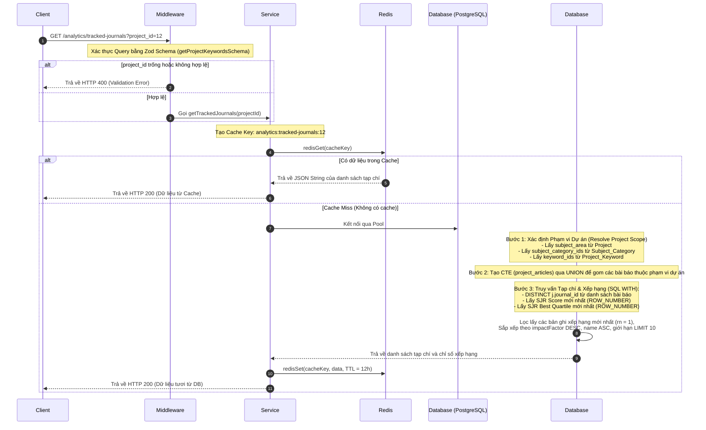
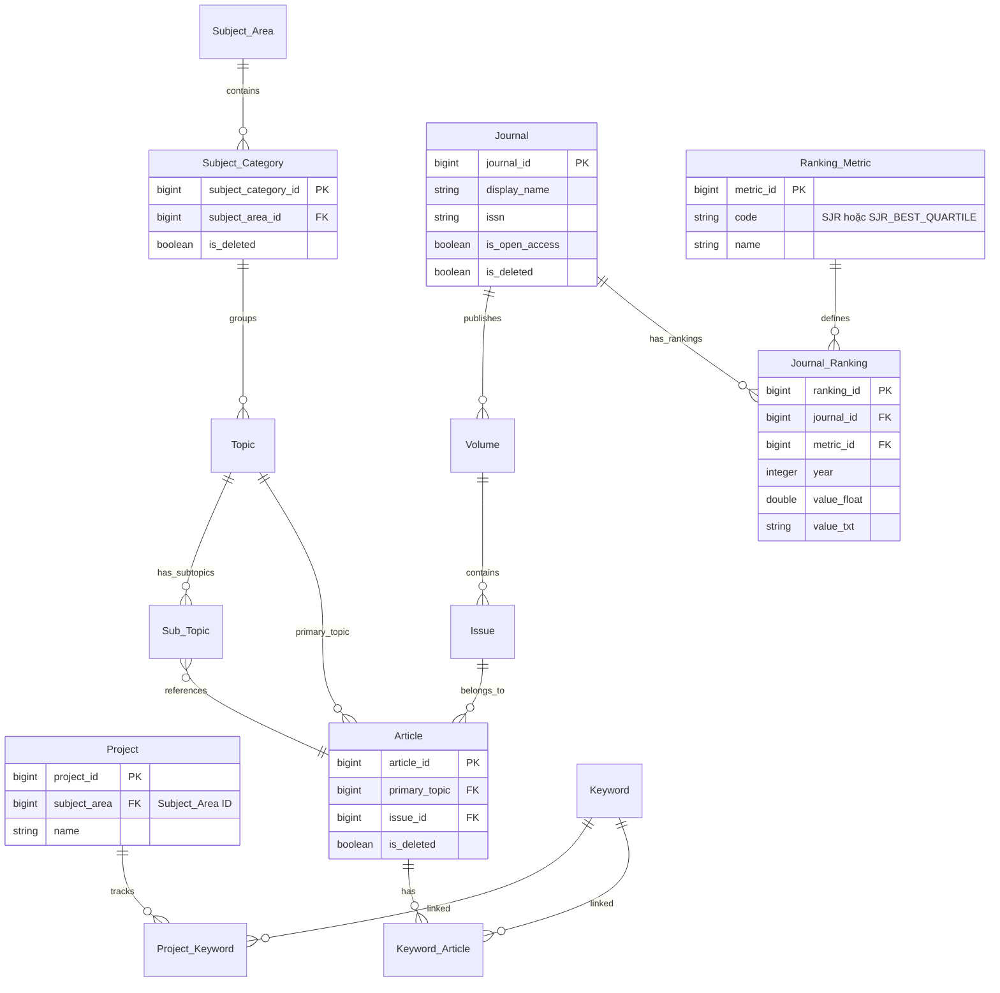

# Tài liệu Chi tiết API: `/analytics/tracked-journals`

API này chịu trách nhiệm lấy danh sách các tạp chí (journals) khoa học được liên kết với các bài báo nằm trong phạm vi giám tuyển của một dự án cụ thể. Tương tự như API bài báo giám tuyển, phạm vi tạp chí được xác định dựa trên lĩnh vực nghiên cứu (subject area) và từ khóa mà dự án đang theo dõi. Kết quả trả về chứa thông tin chi tiết về tạp chí kèm các chỉ số xếp hạng SJR (Scimago Journal Rank) mới nhất.

---

## 1. Thông tin chung (Endpoint Overview)

* **URL ví dụ:** `https://api.trending.researchpulse.io.vn/analytics/tracked-journals?project_id=12`
* **HTTP Method:** `GET`
* **Content-Type:** `application/json`
* **Cơ chế lưu trữ:** Hỗ trợ Cache bằng Redis với thời gian sống (TTL) là **12 giờ** (43,200 giây). Cache tự động bị xóa (invalidated) khi dự án có sự thay đổi về từ khóa được theo dõi.

---

## 2. Tham số truy vấn (Query Parameters)

Dưới đây là chi tiết tham số được truyền qua Query String:

| Tham số | Kiểu dữ liệu | Bắt buộc | Mặc định | Mô tả |
| :--- | :--- | :---: | :---: | :--- |
| **`project_id`** | String | **Có** | - | ID của dự án để xác định phạm vi phân tích và lọc dữ liệu tạp chí. |

---

## 3. Luồng xử lý chi tiết (Detailed Workflow)

API hoạt động thông qua một quy trình xác thực chặt chẽ, kiểm tra cache và thực hiện truy vấn phức tạp trên cơ sở dữ liệu PostgreSQL:



### Các bước thực thi chính trong mã nguồn:

1. **Xác thực dữ liệu (Request Validation):**
   * Sử dụng Zod schema `getProjectKeywordsSchema` để kiểm tra tính hợp lệ của query parameter. Đảm bảo tham số `project_id` có giá trị và không trống.

2. **Xác định Phạm vi của Dự án (Resolve Project Scope):**
   * Truy vấn bảng `"Project"` để tìm dự án. Nếu dự án không tồn tại, trả về mảng rỗng `[]`.
   * Lấy danh sách `subject_category_id` từ bảng `"Subject_Category"` thuộc về `subject_area_id` của dự án đó.
   * Lấy danh sách các `keyword_id` đang được dự án theo dõi từ bảng `"Project_Keyword"`.
   * Nếu dự án không có cả danh mục môn học lẫn từ khóa theo dõi, trả về mảng rỗng.

3. **Xây dựng câu truy vấn bảng tạm (CTE - Common Table Expressions):**
   * Định nghĩa CTE `project_articles` để gộp tất cả bài báo thuộc phạm vi danh mục môn học (qua `Topic` hoặc `Sub_Topic`) và từ khóa được dự án theo dõi.

4. **Xác định thông tin xếp hạng Tạp chí mới nhất (SJR & Quartile):**
   Hệ thống thực hiện phân tích phức tạp trên cơ sở dữ liệu qua các khối con trong truy vấn SQL:
   * **`project_journals`:** Lọc ra danh sách tạp chí không trùng lặp (`DISTINCT`) bằng cách kết hợp tập bài báo trong dự án với các bảng `"Issue"`, `"Volume"` và `"Journal"`.
   * **`journal_sjr` (Điểm Impact Factor):** Truy vấn bảng `"Journal_Ranking"` kết hợp với `"Ranking_Metric"` nơi metric là `'SJR'`. Sử dụng phân tích cửa sổ `ROW_NUMBER() OVER (PARTITION BY jr.journal_id ORDER BY jr.year DESC) AS rn` để luôn trích xuất điểm số của năm mới nhất.
   * **`journal_quartile` (Hạng phân vùng Quartile):** Truy vấn bảng `"Journal_Ranking"` với metric là `'SJR_BEST_QUARTILE'` để lấy hạng phân vùng cao nhất của năm gần nhất bằng hàm cửa sổ tương tự.

5. **Tổng hợp dữ liệu kết quả:**
   * Kết hợp dữ liệu từ `project_journals` với dòng xếp hạng mới nhất (`rn = 1`) từ `journal_sjr` và `journal_quartile`.
   * Sắp xếp kết quả theo thứ tự điểm Impact Factor giảm dần (`"impactFactor" DESC NULLS LAST`), sau đó theo tên tạp chí tăng dần.
   * Giới hạn kết quả trả về là **tối đa 10 tạp chí** (`LIMIT 10`).

---

## 4. Sơ đồ Quan hệ Cơ sở Dữ liệu (Database Schema Relationship)

Mối liên hệ giữa các bảng cơ sở dữ liệu tham gia vào quá trình xử lý của API:



---

## 5. Cấu trúc Phản hồi (Response Structure)

### 5.1 Phản hồi thành công (HTTP 200 OK)

Phản hồi trả về danh sách tối đa 10 tạp chí được sắp xếp theo tầm ảnh hưởng giảm dần:

```json
{
  "code": 200,
  "message": "Fetch tracked journals successfully",
  "data": [
    {
      "id": "12",
      "name": "Nature Reviews Drug Discovery",
      "publisher": "Unknown Publisher",
      "issn": "14741784",
      "impactFactor": 32.577,
      "sjrRank": "Q1",
      "trend": [0, 1, 2, 1, 3, 2, 4],
      "cover": "https://via.placeholder.com/48x64/f1f5f9/1a1a1a?text=NAT"
    },
    {
      "id": "28",
      "name": "Expert Opinion on Drug Discovery",
      "publisher": "Unknown Publisher",
      "issn": "1744764X",
      "impactFactor": 6.82,
      "sjrRank": "Q1",
      "trend": [0, 1, 2, 1, 3, 2, 4],
      "cover": "https://via.placeholder.com/48x64/f1f5f9/1a1a1a?text=EXP"
    }
  ]
}
```

> [!NOTE]
> * Trường `publisher` hiện tại mặc định trả về `'Unknown Publisher'`.
> * Trường `trend` là mảng số liệu tĩnh cố định đại diện cho xu hướng hoạt động qua các năm.
> * Trường `cover` tự động tạo hình ảnh placeholder dựa trên 3 ký tự đầu tiên của tên tạp chí.

### 5.2 Phản hồi lỗi xác thực (HTTP 400 Bad Request)

Xảy ra khi query parameter `project_id` bị thiếu hoặc trống.

```json
{
  "code": 400,
  "message": "Validation error",
  "errors": {
    "project_id": [
      "project_id is required"
    ]
  }
}
```

### 5.3 Phản hồi khi dự án trống hoặc không tồn tại (HTTP 200 OK)

Nếu dự án không tồn tại hoặc không theo dõi bất cứ danh mục/từ khóa nào, hệ thống trả về mảng rỗng:

```json
{
  "code": 200,
  "message": "Fetch tracked journals successfully",
  "data": []
}
```
